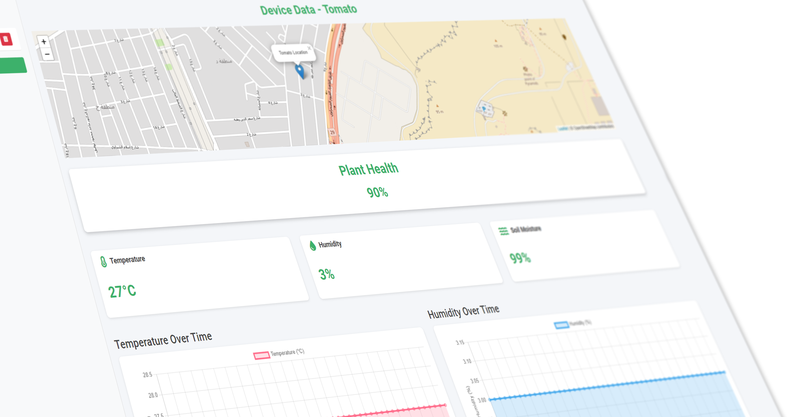
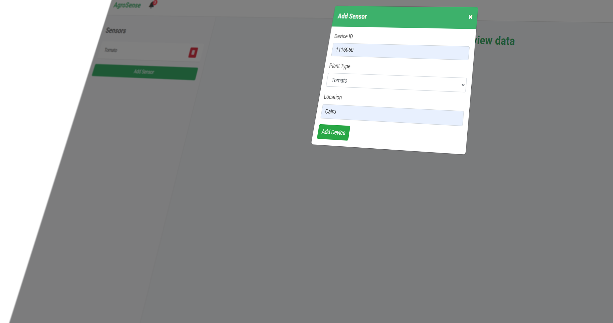
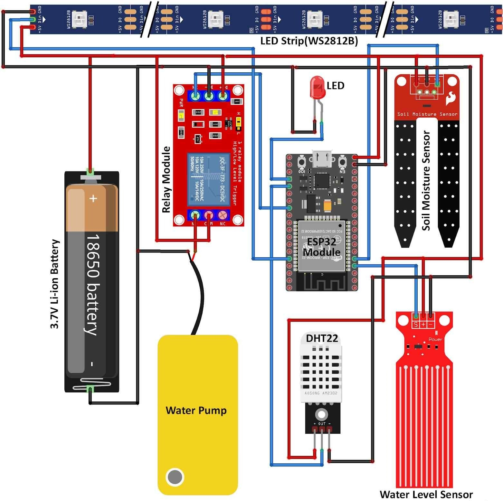

# AgroSense

AgroSense is an innovative IoT-based agricultural monitoring system designed to empower farmers with real-time insights into their crops' health and environmental conditions. By seamlessly integrating hardware sensors with a user-friendly web dashboard, AgroSense facilitates data-driven decision-making to optimize crop yield and resource management.

AgroSense Dashboard : https://virtu4l.pythonanywhere.com/
---

## Features

- **Real-Time Monitoring:** Track temperature, humidity, soil moisture, and plant health in real-time.
- **User-Friendly Dashboard:** Visualize data through interactive charts and maps.
- **Alerts & Notifications:** Receive alerts when sensor readings exceed predefined thresholds.
- **Data Logging:** Store historical data for trend analysis and reporting.
- **Easy Device Management:** Add, view, and delete sensor devices seamlessly.

---

## Project Status

🚧 **Under Development** 🚧

AgroSense is currently in the development phase.
---

## Screenshots

### 1. Dashboard Overview

*The main dashboard displaying real-time sensor data and plant health status.*

### 2. Device Management

*managing sensor devices, including adding and deleting sensors.*

---

## Hardware Components

### Current Components

- **ESP Microcontroller:** Handles Wi-Fi connectivity and data transmission.
- **DHT22 Sensor:** Measures temperature and humidity.
- **Soil Moisture Sensor:** Monitors soil moisture levels.
- **Breadboard & Wires:** For prototyping and circuit connections.
- **Power Supply:** Powers the microcontroller and sensors.

### Final Version Components

- **Wi-Fi Antenna:** Enhances wireless connectivity range and stability.
- **Soil pH Sensor:** Measures the acidity or alkalinity of the soil.
- **Lithium Battery:** Provides reliable power storage for the system.
- **Battery Level Indicator:** Displays the current battery charge level.
- **GPS Module:** Tracks the geographical location of the device.
- **Light Sensor:** Monitors ambient light conditions.
- **Solar Battery Charger:** Utilizes solar energy to recharge the lithium battery.
- **LCD Screen**: Allows for easy configuration of the ESP, including Wi-Fi network connection setup
---
## Case Desgine:
### 
*The Prototype Case of Agrosense , desgined for compactness and reliability.*

---
## Circuit Diagram:

*A detailed schematic of the AgroSense prototype circuit illustrating connections between the ESP and various sensors.*
---
## Software Components
- **C++ for ESP Programming:** Core programming language for handling ESP functionality.
- **WiFiManager Module:** WiFi Connection manager with a fallback web configuration portal to easily set up the device's Wi-Fi network.
- **Flask:** Backend framework for handling server-side operations.
- **Flask-Login:** Manages user authentication and session management.
- **Flask-WTF:** Handles form validations and CSRF protection.
- **SQLAlchemy:** ORM for database interactions.
- **Chart.js:** JavaScript library for creating interactive charts.
- **Leaflet.js:** Library for embedding interactive maps.
- **Bootstrap:** Frontend framework for responsive design.
- **JavaScript & AJAX:** For dynamic content loading and interactions.

